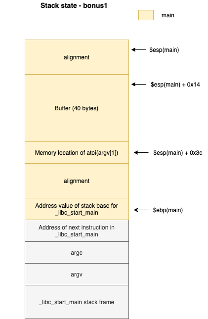

State of the stack in this exercise :



1. the first argument is converted to an integer n via `atoi()`

2. It must be lower than 9 so that the program enters the `memcpy` part.

3. The memcpy copies `argv[2]` into a buffer located 40 bytes above the location of n.

4. Then n is compared to **0x574f4c46** and if equals : we get a shell and the flag.

5. Issue : memcpy copies only **4 * n** bytes of argv[2] which is maximum 36 bytes as n cannot be above 9.

6. The exploit:
    - the number of bytes provided to memcpy is casted to **size_t**, which lies between 0 and 4 294 967 295 (INT_MAX) on a 32 bits processor.
    - hence, if we provide a negative number, it will be lower than 9 and enter the first if statement. It needs to be sufficiently low to become, once multiplied by 4 and casted into size_t, 44 (as we will write 40 random bytes + the number n will be compared to)
    - Let's take INT_MIN + 11 = ** -2 147 483 648 + 11 = -2 147 483 637**
    - Indeed, when casted to size_t, the 32 bits (4 bytes) of a number are taken, and the resulting number is considered positive (so if the negative bit, which is the 32nd bits is on, the number will be positively huge).
    -2 147 483 637 in hex : **0x80 00 00 0b**.
    When multiplied by 4 we have : **0x02 00 00 00 2C** => overflow of max size_t => we keep only the 4 bytes which makes **0x00 00 00 2c** or 44!

7. So we have the arguments we must pass to the program :
    - arg1 = **-2 147 483 637**, which is lower than 9 as an int and will make it 44 when multiply by 4 (INT_MAX overflow)
    - arg2 = 40 bytes to fill up the buffer, and four bytes to erase the memory location of n, with the value we want to compare it with : **"A" * 42 + "\x46\x4c\x4f\x57"**

8. Result:

```
bonus1@RainFall:~$ ./bonus1 -2147483637 $(python -c 'print("A"*40 + "\x46\x4c\x4f\x57")')
$ whoami
bonus2
$ cat /home/user/bonus2/.pass
579bd19263eb8655e4cf7b742d75edf8c38226925d78db8163506f5191825245
```
