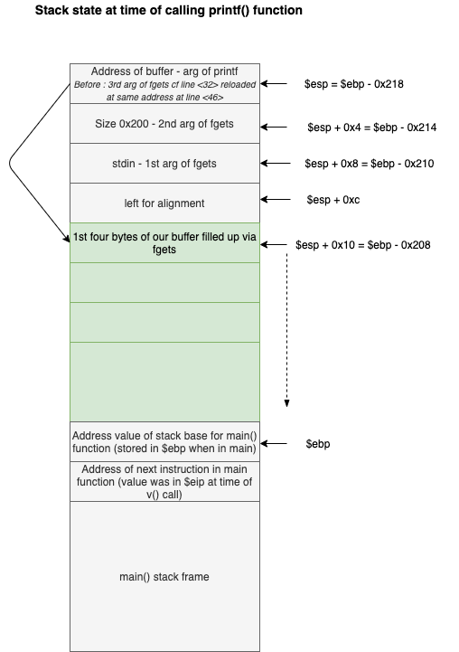

1. We disass main and see that it just calls a `v()` function


2. we disassemble the v() function :

    - First it calls `fgets()` with a buffer located at `$ebp-0x208`, a size of `0x200` reading `stdin`
      The fgets() function, compared to the gets() function, verify the length of the buffer and protect it against bof with a `\0`.
      Hence we won't be able to implement a bof attack through gets.

    - Then we can see that there is a call to `printf` with only one argument which is our buffer address (hence where the string we provided to `fgets()` through stdin is stored). This is a bad implementation of printf :
    Good implementation : `printf("%s", buf)` --> no other interpretation possible than reading a string up to `\0`
    Vulnerable implementation : `printf(buf)` --> if buf is a string with fomatters (%x...) then printf will try to read corresponding arguments on the stack. With the `%n` modifier, we can write in memory at address given to printf function as argument, with the number of characters already written up to this midifier. We will use this for our attack.

    - Then, the value stored at address `0x804988c` (line <+54>) is compared to 0x40 (64 in decimal). If it is the case then a shell is executed with the executable owner's permissions.


3. Let's analyze the state of the stack frame at time of calling printf:

    

    Hence, when printf is called with our buffer address as argument; if we write for example `%x` inside the buffer,
    printf will look for a second argument right below its "first argument"... and it will print `0x200`, which is the value at the following address on the stack!


4. The attack:

    If we manage to write 64 bytes in the buffer, starting with the address at which we would like to save the value of `%n` (number of bytes written up to there), and then specify to printf that %n is teh address at the beginning of our buffer, it would work! We would have 0x40 stored at this address, and the following comparison (in v()) would enter the if!

    We can see that the address will be at the beginning of our buffer, which is located four memory addresses after our printf argument. Hence we have to specify printf that we want the `%n` modifier to be its "fourth" argument so that it will get this address and stored the number of printed characters there.


    ```
    level3@RainFall:~$ (python -c 'print("\x8c\x98\x04\x08%60d%4$n")') > /tmp/exploit
    level3@RainFall:~$ cat /tmp/exploit - | ./level3
    �                                                         512
    Wait what?!
    whoami
    level4
    cat /home/user/level4/.pass
    b209ea91ad69ef36f2cf0fcbbc24c739fd10464cf545b20bea8572ebdc3c36fa
    ```

    Explnations of the string:
        - The first four bytes represent the address at which we will want to save the number of bytes printed. It is the address which will be compared to `0x40` that we can find at line <+54>.
        - Then, as we want to print out 64 bytes, but already printed 4 bytes with the address, we have to print 60 bytes. We can use the **width** parameter of printf, which prints as many spaces as to make the whole output of %d be 60 bytes long.
        - `%4$n` means we want a **%n** modifier (hence we want to save the number of bytes printed up to there), at the address stored as your fourth modifier parameter (so that it moves 4 addresses, or 4 x 4 = 16 bytes inside the stack to get the address). This address is the address we ourselves wrote on the stack at the beginning of our buffer!